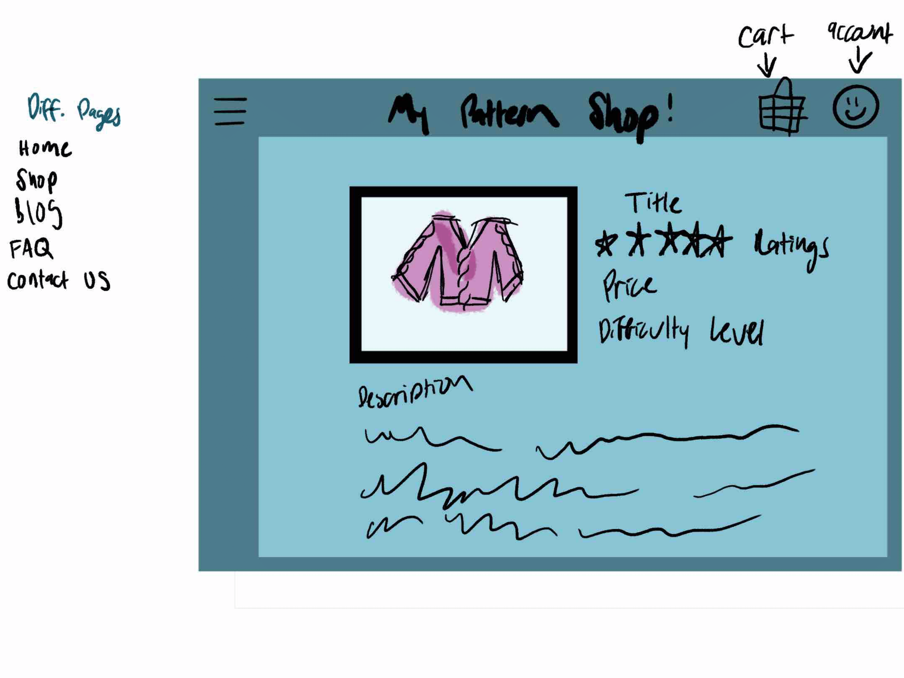

# startup
[notes file](notes.md)

# Fiber Arts Shop:

## Elevator Pitch:
Since the start of the pandemic, fiber arts such as knitting and crocheting have rose in popularity. As such, the number of pattern sellers and hand-made goods. The majority of these users have their blogs and social media pages direct to an online store on Etsy or Ravelry. While these shops are excellent places to be noticed and sell your goods, they also require a person to go to a new website and the new website takes a chunk of income. What if you could do this all in one place? It certainly isn't a new idea but it could make a huge difference in these shops and blogs.

## My Design:

In my design we have a pretty standard website set up. We have blog pages where the pattern or product is imbedded in the post, or found in the shop page. In this shop page, buyers are able to leave reviews and comments. They are also able to see related projects, materials, difficulty level, etc. 

Each user has the ability to sign in, which they must do in order to make a purchase. There on their account they can save an address, purchase history, and contact information. We also have a cart tab that is linked to this individual account.
The shop owner can change the items on sale as well as the related blog posts, it gives them the complete freedom to do what they want with their creations. They are able to respond to comments and view deeper insight to the ratings.

## Technologies:

### Authentication:
As stated above, the user is required to sign in in order to make a purchase. This then opens their account where they save their name, address, and contact information. All of the user's data is saved under their account. Through this account they are able to leave comments and reviews. It works, I am still troubleshooting my login button to allow them to log in, but everything should be there, I just need to connect a few dots.

### Database Data:
This is where all of the reviews and purchases go. Each item saves the reviews and shows the average star rating as well as the comments. The owner of the site is able to view each of the purchases and if they were linked to a review. They are able to see the contact information and reach out to the buyers and send updates. Of course for now it is used to store login data in my blog page.

### Websocket Data:
This is how the comments and reviews are entered into the site. You can see the most recent comments and reviews, respond to those, ask questions, etc. Through the Simon database I was able to play around with this data. I was able to connect it to my database and display it onto my simon webpage. I have that linked to my blog page. It is still a bit buggy but the code is there, I just need to fix it.

### React Data:
I have created react data, which you will see inside my src folder. The whole website is now run on react! 

### Services
I have integrated the services folder that has all of the database information and the linking code to keep my website working.

### HTML
All webpages are written out, they are linked together and have different things on each one. I want to edit the color scheme and make it look more professional over time.

### CSS
There is a consistant color scheme and font going through the site.

### JS
Most of my code is written in JSX now, but I still have JS inside if it is not directly affecting a page.
